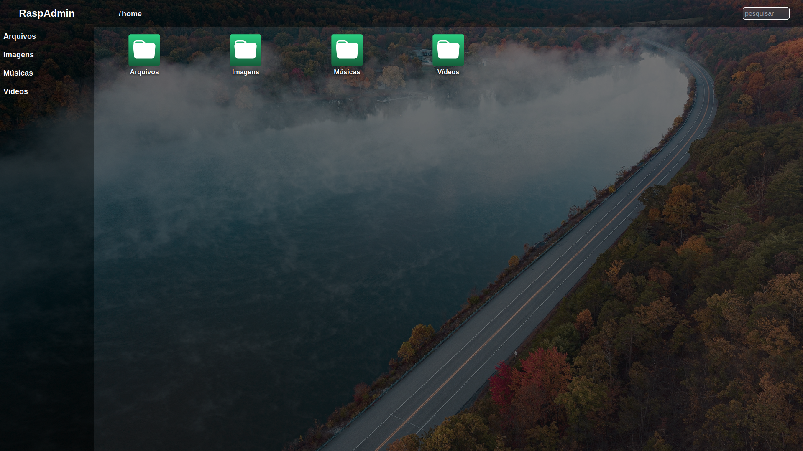
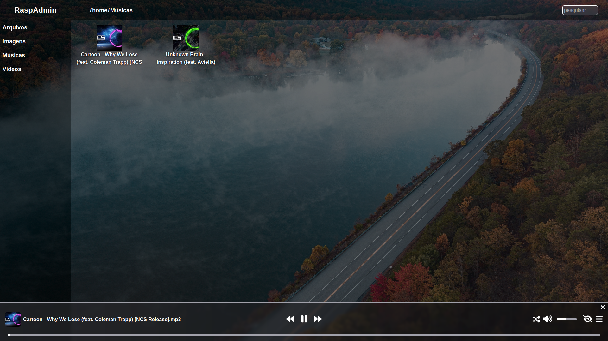

## Raspadmin files react

Um visualizador de arquivos web, tem como objetivo facilitar a listagem de arquivos em servidores remoto
Reproduz media como vídeos e áudios, visualiza imagens, faz downloads.

Esse projeto iniciou como uma estilização do famoso "indexof" do nginx/apache2, porém acabou tomando outro rumo.

[Link Demo](https://raspadmin-files-react.vercel.app/)

[Como instalar](https://github.com/mundotv789123/raspadmin-files-react/blob/main/INSTALL.md)

### Listagem de arquivos
> Lista de arquivos e pastas, na barra lateral fica as pastas principais.

### Reprodução de músicas
> Ao clicar em um arquivo de áudio é aberto imediatamente um menu com todas as músicas que foram encontrado na pasta.

### Reprodução de músicas com playlist
> Ao clicar na seta é possível ver a playlist que foi gerada com base a música clicada.

### Reprodução de vídeo
> Ao clicar em um arquivo de vídeo automáticamente abre um reprodutor de vídeo em tela cheia.

### Demonstração
> Gif demonstrando a interface.

